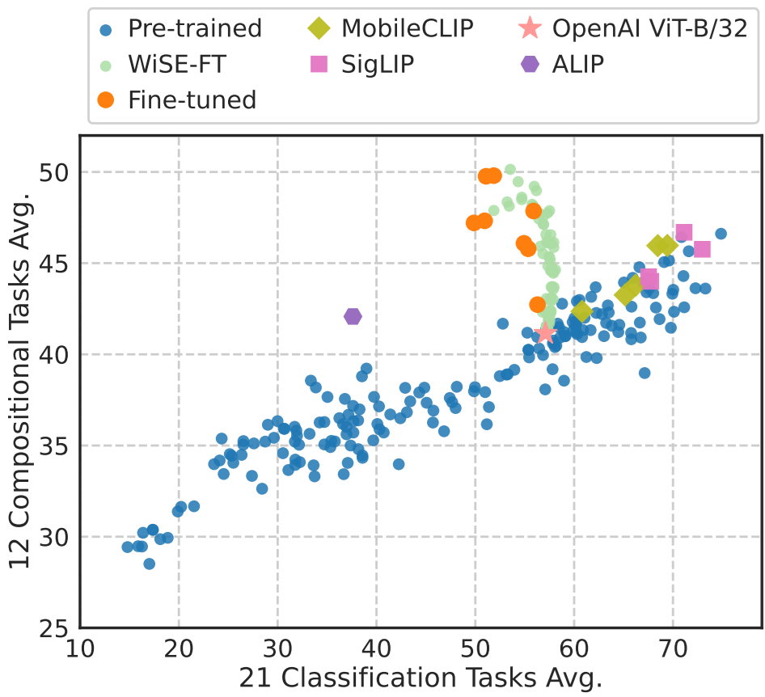

# <div align="center">Exploring the Spectrum of Visio-Linguistic Compositionality and Recognition<div> 

This is the repository for the paper:
> <a href="https://github.com/ytaek-oh/vl_compo"><b>Exploring the Spectrum of Visio-Linguistic Compositionality and Recognition</b></a><br />
> [Youngtaek Oh](https://ytaek-oh.github.io), Pyunghwan Ahn, Jinhyung Kim, Gwangmo Song, Soonyoung
Lee, [In So Kweon](http://rcv.kaist.ac.kr/), [Junmo Kim](http://siit.kaist.ac.kr/)
> <br />CVPR Workshop on ‘<a href="https://sites.google.com/view/2nd-mmfm-workshop/" target="_blank">What is Next in Multimodal Foundation Models?</a>’ (MMFM), 2024

## News 
- **[June 14]** Currently, the codes are under review before being made public (Expected date: Early July).
<br />

## Abstract
**TL;DR We comprehensively curate VLMs and benchmarks for comositionality and recognition evaluation!**
<details><summary>Click to expand</summary>
<p>Vision and language models (VLMs) such as CLIP have showcased remarkable
zero-shot recognition abilities yet face challenges in visio-linguistic
compositionality, particularly in linguistic comprehension and fine-grained
image-text alignment.
</p>  
<p>This paper explores the intricate relationship between
compositionality and recognition -- two pivotal aspects of VLM capability. We
conduct a comprehensive evaluation of existing VLMs, covering both pre-training
approaches aimed at recognition and the fine-tuning methods designed to improve
compositionality. Our evaluation employs 12 benchmarks for compositionality,
along with 21 zero-shot classification and two retrieval benchmarks for
recognition.</p> <p>
In our analysis from 274 CLIP model checkpoints, we reveal
patterns and trade-offs that emerge between compositional understanding and
recognition accuracy. Ultimately, this necessitates strategic efforts towards
developing models that improve both capabilities, as well as the meticulous
formulation of benchmarks for compositionality.</p>
</details>

<p align='center'>
   <br />
<b>
Overall trends of pre-trained and fine-tuned CLIP models between 12 compositionality and 21 zero-shot classification tasks.
</b> <br />
  <a href="./results.csv">[results.csv]</a>
</p>


## BibTeX
If you find this repository useful, please consider citing our paper with the following bibtex:
```bibtex
@article{oh2024exploring,
      title={Exploring the Spectrum of Visio-Linguistic Compositionality and Recognition}, 
      author={Oh, Youngtaek and Ahn, Pyunghwan and Kim, Jinhyung and Song, Gwangmo and Lee, Soonyoung and Kweon, In So and Kim, Junmo},
      journal = {arXiv preprint},
      year={2024},
      url={[https://arxiv.org/abs/2406.07522](https://arxiv.org/abs/2406.09388)}
}
```
